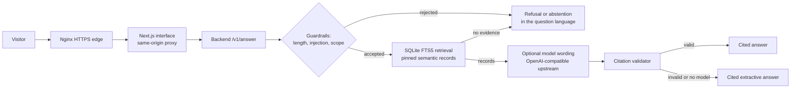

# RAG Chat

RAG Chat is a small, bounded research chat for a versioned public-data corpus. A visitor asks one question and receives a cited answer or an explicit abstention, in the language of the question. It is a template: the product is corpus-agnostic, and each deployment loads one *corpus profile*.

The first profile is the **PNCP corpus profile**, built from the semantic layer of the public PNCP Kaggle catalogue (Brazil's national public procurement portal).

## What it proves

- Retrieval and guardrails run before any model call. An out-of-scope question, a prompt-injection attempt, or an oversized request never reaches the model.
- Every supported answer cites record identifiers, the Kaggle dataset slug, and the pinned release version. A model answer is accepted only if every citation points to a record that retrieval returned.
- The model is optional. If the upstream model is unavailable, the service answers in cited extractive mode and says so.
- Answers and abstentions follow the visitor's language (tested in English and Brazilian Portuguese).

## Architecture



Alt text: a visitor reaches an Nginx edge, then the interface and its proxy, then the backend. The backend applies guardrails, retrieves records from a local index, optionally asks a model to phrase the answer, validates the citations, and falls back to an extractive answer.

## Repository layout

| Path | Purpose |
|---|---|
| `app/`, `components/`, `lib/` | Next.js interface and same-origin API proxy (accepts only a `question` field, 1,000 characters at most) |
| `backend/rag_chat_backend/` | Guardrails, language detection, SQLite FTS5 index, model client, citation validation, HTTP server |
| `backend/tests/` | Unit tests for language, refusal, abstention, and citation contracts |
| `tests/e2e/` | Playwright interface tests |
| `docs/` | Corpus contract, deployment notes, evidence records |

## Quick start

```bash
# backend tests
cd backend && python -m pip install -e ".[dev]" && python -m pytest -q

# build an index from a semantic Parquet file of the pinned release
python -c "from pathlib import Path; from rag_chat_backend.index import build_index; \
build_index(Path('semantic.parquet'), Path('index.db'), {'data_cutoff': '2026-07-31', 'table_count': 1})"

# run the backend (extractive mode when QWEN_BASE_URL is unset)
RAG_INDEX_PATH=index.db RAG_DATASET_SLUG=owner/dataset RAG_RELEASE=v1 python -m rag_chat_backend.server

# run the interface
npm install && RAG_CHAT_BACKEND_URL=http://localhost:8080 npm run dev
```

## Corpus contract

A corpus profile pins a Kaggle dataset slug, its version, the release manifest hash, and the data cutoff. The backend indexes only Parquet files whose hashes match that manifest. See [docs/corpus-contract.md](docs/corpus-contract.md).

## Limits

- Retrieval is lexical (BM25). It answers questions that share words with a record; it does not reason across records or compute aggregates beyond match counts.
- Answers describe what the released records say. They are not legal advice, an eligibility assessment, or a supplier recommendation, and the corpus does not cover all national procurement.
- The public demo accepts one question at a time, no uploads, no model selection, and no tools.

## Related repositories

- [brazil-public-data-map](https://github.com/LucasRangelSSouza/brazil-public-data-map): source registry and Kaggle release tooling
- [ai-platform-rag-observability](https://github.com/LucasRangelSSouza/ai-platform-rag-observability): the RAG kernel this project builds on
- [distributed-agent-runtime-lab](https://github.com/LucasRangelSSouza/distributed-agent-runtime-lab): deployment composition and dashboards

## License

Apache-2.0 for code and documentation. The corpus retains its source terms; see the dataset cards.
